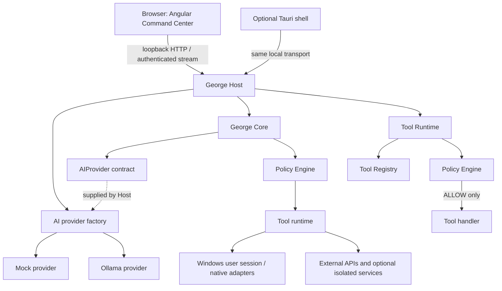
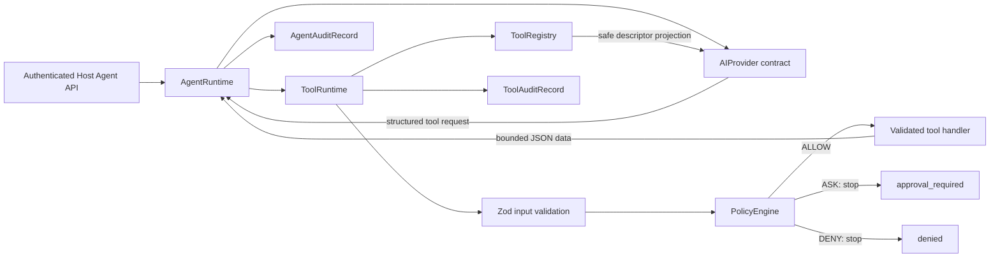

# Architecture

## Current components and boundaries

| Package              | Responsibility                                               | Depends on                  |
| -------------------- | ------------------------------------------------------------ | --------------------------- |
| `@george/protocol`   | Domain contracts shared across boundaries                    | None                        |
| `@george/policy`     | Deterministic default allow/ask/deny policy                  | protocol                    |
| `@george/tools-sdk`  | Tool metadata, Zod input schema, handler contract            | protocol, Zod               |
| `@george/config`     | Profile schema and explicit parse errors                     | protocol, Zod               |
| `@george/core`       | Agent request and provider-neutral tool orchestration        | protocol, tools-core        |
| `@george/ai`         | Mock/Ollama adapters, selection, model catalog, availability | config, protocol            |
| `@george/tools-core` | Tool registry, policy-gated runtime, safe built-ins          | tools-sdk, policy, protocol |
| `@george/host`       | Per-user local HTTP Host, sessions, SSE, app serving         | core, config, ai, Fastify   |
| `@george/web`        | Angular Command Center browser client                        | protocol, Angular           |

M2 implements the local web interface with a native-capable Host:

The Host owns lifecycle, Core initialization, local HTTP and SSE transports, and coordination of
configuration, agent runtime, events, and in-memory audit. The Command Center communicates with
Core only through the Host API. The Host binds exclusively to `127.0.0.1`; `0.0.0.0` is rejected
by configuration. The default port is defined once in `george.defaults.json` and can be overridden
with `GEORGE_HOST_PORT`. Remote access is not configurable in M2.

The browser UI is the primary experience, not the native boundary. An optional Tauri shell may
provide a desktop window, system tray, launcher, autostart integration, native notifications, and
hotkeys while using the same Host API. A normal browser remains a supported client. Docker is
optional for MCP servers, databases, AI services, or isolated auxiliary processing; capabilities
that interact with the user's live desktop run in the user's OS session outside Docker.

The Host normally runs in the signed-in user's Windows session, never permanently as `LocalSystem`.
Autostart must be opt-in and user-disableable. Future privileged operations go through policy,
approval, and a narrowly scoped UAC/elevated helper; the ordinary Host does not retain permanent
administrative rights. macOS and Linux implementations remain possible through platform adapters.

The current Core remains platform-neutral: no Windows-specific calls or hardcoded Windows paths.
No `platform` package or interface is added until a concrete capability needs a platform contract;
OS-specific implementation belongs in an adapter with an actual responsibility. Package consumers
import public exports, never another package's source or internal paths. Protocol stays dependency-free.

## Agent Runtime (M1)

`@george/core` now owns a small `AgentRuntime` composed through explicit constructor dependencies:
an `AIProvider`, `ToolRuntime`, `AgentEventSink`, and `AuditSink`. The runtime validates untrusted request input,
generates an unpredictable `requestId` with `node:crypto` (`randomUUID` by default), preserves the
caller-supplied `conversationId`, creates a request context, invokes the provider, maps a safe
response, and records lifecycle information. A clock and ID factory can be injected for tests.
It knows only the provider-neutral contract and public ToolRuntime API; provider wire formats remain
in `@george/ai`, while policy and handlers remain in `@george/tools-core`. `MockAIProvider` remains a deterministic in-memory implementation for Core tests. The Host
selects its configured provider through `@george/ai`, which owns the mock adapter, Ollama HTTP
adapter, model catalog, and provider health mapping. This package boundary is justified now that
provider implementations and management have independent responsibility. Core still knows only
the `AIProvider` contract, so a future Anthropic adapter can join the factory without changing
`AgentRuntime`.

AI configuration defaults to `mock`. Ollama requires an explicit model and accepts only an HTTP
loopback origin (`127.0.0.1`, `localhost`, or `::1`); redirects are rejected. Native fetch calls
`/api/chat` for complete, non-streaming responses and `/api/tags` for discovery. Host startup does
not probe Ollama, so Host remains online while AI is unavailable. Provider state is exposed
separately from Host health and Agent state. Before a tool request, the adapter checks `/api/show`
for the selected model's advertised `tools` capability and fails closed when it is absent.
Discovery never downloads models.

`AgentRequest` contains only `conversationId`, `channel`, `input`, and caller timestamp
`receivedAt`; the Host/caller supplies conversation identity, while Core generates a fresh
`requestId` per attempt. The request lifecycle begins with `request.received` and
`request.processing`, emits `provider.started` for each provider turn and safe tool lifecycle events
for each call, then emits `provider.completed` and `request.completed`, or `request.failed` on
failure. ASK ends with `tool.approval_required` and a structured `approval_required` response;
cancellation uses the standard `AbortSignal` and produces a safe `CANCELLED` response.

`AgentEventSink` reports operational lifecycle events for future UI/streaming consumers. Events
carry IDs, channel, timestamp, and limited safe metadata; they omit request content and response
content. `AuditSink` records a separate, structured trace of request start and outcome, duration,
error code, and safe provider metadata; it also omits prompts, responses, and secrets. Both are
ports, not transports or databases. M1 includes in-memory implementations. Sink failures are
isolated so telemetry does not leak internal exceptions or change a successful provider result.

Errors use a small code set (`INVALID_REQUEST`, `PROVIDER_UNAVAILABLE`, `PROVIDER_ERROR`,
`CANCELLED`, `INTERNAL_ERROR`). Adapters can identify unavailability with a typed
`PROVIDER_UNAVAILABLE` code; otherwise unexpected provider failures map to `PROVIDER_ERROR`, and
non-provider runtime faults map to `INTERNAL_ERROR`. `AgentRuntimeError` may retain an internal cause, while
`AgentResponse` contains only the code and fixed safe message; causes, stacks, tokens, paths, and raw
provider payloads are never copied into the public response.

Operational events and audit records serve different purposes: events drive live activity views;
audit records support later traceability and review. Neither is a conversation store.

## Request and tool flows

M4.1 connects `AgentRuntime` to the policy-gated Tool Runtime in process:

Every valid tool input is evaluated by PolicyEngine before its handler. Missing permission and
critical risk are denied by the existing default policy; high risk returns `APPROVAL_REQUIRED`
without a handler call. M4 has no approval flow. Runtime passes a bounded `AbortSignal`, caps tool
timeouts, returns typed safe outcomes, and writes a redacted `ToolAuditRecord` through the shared
`AuditSink`. Audit retains identifiers, risk/policy outcomes, timing, status, and safe error codes;
tool input/output are not recorded. Audit storage remains in-memory and bounded by the Host process
lifecycle.

`system.info` is the first built-in. It uses portable `node:os` APIs and returns platform,
architecture, hostname, CPU model/count, memory totals, and uptime. It does not expose home paths,
environment variables, or network interfaces. `system.process.list` is deferred because listing
processes requires an OS-specific adapter and a separate disclosure review; no `@george/platform`
package is justified by `system.info` alone. Tool outputs from future external adapters remain
untrusted input and need validation before being used by an Agent.

The provider receives only `AIToolDescriptor` projections (`id`, description, input schema). Tool
permissions, risk, policy and handlers remain inside George. Structured calls are requests, never
authorization. `AgentRuntime` invokes `ToolRuntime` sequentially (up to four tool-call rounds and
eight calls per round), stops on ASK/DENY/invalid calls, propagates the request signal, and bounds
each serialized tool result to 16 KiB. Results stay in an in-memory request-local transcript as
structured `tool` messages; they are never inserted into system instructions or saved between
requests. Parallel execution is deferred for a later milestone review.

Timeout ownership: the adapter bounds each provider call (Ollama: 120 seconds), ToolRuntime bounds
each handler call (up to 120 seconds), and Host owns the total Agent HTTP request timeout (130
seconds) and cancellation signal. AgentRuntime does not add a competing timer.

## HTTP API and local sessions (M2)

Fastify 5 provides the typed server, Pino logger, and `inject`-based integration tests. Host routes
include `GET /api/v1/health`, session-authenticated `GET /api/v1/ai/status`,
`GET /api/v1/ai/models`, `GET /api/v1/tools`, `POST /api/v1/tools/:id/execute`,
`POST /api/v1/session/bootstrap`,
`POST /api/v1/agent/requests`, and `GET /api/v1/agent/events`. Request bodies are capped at 16 KiB;
agent text is capped at 4,000 characters. Connection/request timeouts and header-size limits are
configured at the server boundary. Error responses omit internal causes and stacks.

The Host issues an eight-hour, cryptographically random, in-memory session cookie with `HttpOnly`,
`SameSite=Strict`, and `Path=/`. Bootstrap returns a separate random CSRF token to page memory; state
changing requests require both the cookie and `X-George-CSRF`, compared in constant time. Sessions
expire at shutdown and bootstrap is rate/size bounded. HTTP localhost does not provide transport
confidentiality against local processes; the cookie omits `Secure` while serving HTTP because
`127.0.0.1` is not consistently treated as a secure context for cookie transmission. Revisit cookie
attributes if HTTPS is introduced.

Mutating requests require an exact allowlisted `Origin`; SSE validates the exact `Origin` when
provided. When a browser omits it on same-origin EventSource GETs, Host requires
`Sec-Fetch-Site: same-origin` and a Host authority exactly matching an allowlisted loopback origin,
or validates the exact loopback `Referer` origin. No CORS response headers are enabled and
there is no wildcard CORS. Production allows the Host's own origin. Development additionally allows
the loopback Angular dev server origin, which proxies relative `/api/**` requests to Host. A configured
web origin is accepted only when it is an exact loopback HTTP origin. Health is read-only and public.

The Host's `SseAgentEventSink` adapts core events to authenticated SSE subscribers without adding
transport knowledge to Core. Streams receive heartbeats and remove subscribers on disconnect or
shutdown. In-memory audit stays server-side and is never sent to the activity UI. Angular builds are
served as same-origin static assets by Host when present; the dev server proxies API paths and does
not require browser CORS.

The browser keeps `conversationId`, CSRF token, events, and messages in memory only. Host connection
(`ONLINE`, `OFFLINE`, `CONNECTING`) is separate from agent presentation state (`READY`, `THINKING`,
`ERROR`). The Activity Panel labels structured events; it does not derive or invent extra lifecycle
events. The initial layout is a left navigation rail, central orb/chat, and right activity panel.

`ASK` means approval is pending and MUST NOT be treated as authorization or invoke the handler. A
future approval lifecycle must distinguish `PENDING`, `APPROVED`, `DENIED`, and `EXPIRED`, bind an
approval to the requested action, and revalidate it before execution.

### Local transport security

Loopback is a network boundary, not proof that a caller is trusted. A local web server with powerful
tools must defend against malicious web pages and local request forgery. The Host transport must be
designed to include:

- Bind only to `127.0.0.1` by default; add `::1` deliberately and test IPv4/IPv6 behavior.
- Validate `Origin` against the configured Command Center origin; reject unexpected and absent
  browser origins on browser-only sensitive routes.
- Use restrictive CORS; never return `Access-Control-Allow-Origin: *` on sensitive endpoints.
- Authenticate a local session using an unpredictable, short-lived credential established through
  a safe local bootstrap; require authentication on HTTP and WebSocket/stream upgrades.
- Use CSRF defenses for cookie-authenticated state changes, including origin checks and an explicit
  anti-CSRF token where applicable. Do not rely on CORS as CSRF protection.
- Set a strict Content Security Policy in the UI, plus safe response headers such as
  `X-Content-Type-Options: nosniff` and an appropriate `frame-ancestors` policy.
- Bound request body/message sizes, rate-limit where abuse is plausible, and use connection and
  operation timeouts.
- Keep remote access disabled unless explicitly activated with separate authentication, pairing,
  TLS, and policy.

These are design requirements, not implemented controls; they must be tested in M2 before exposing
action-capable endpoints.

## Configuration and data

The checked-in `profiles/default/profile.example.json` is generic and contains no user identity or
secret. At runtime, profile loading will merge defaults, user configuration, and explicit runtime
overrides, then validate through Zod; invalid required settings must fail visibly. Tauri's
application data directory is the planned home for installation data on Windows, with equivalent
platform APIs for other systems. Runtime paths and OS-specific behavior belong in adapters. M0
does not choose or create a runtime data directory. The current example JSON uses the default
assistant name `Assistant` and language `en`; installations supply their own values.

Secret configuration carries a reference such as `credentialRef`; a future `SecretStore` adapter
will use Windows Credential Manager, macOS Keychain, or Linux Secret Service. Secrets are not
stored in profile files or SQLite.

## Audit and activity

M1 defines an audit sink interface that can record request and conversation IDs, channel,
tool, risk level, policy decision, approval state, execution result, duration, timestamp, typed error,
and explicitly safe metadata. Do not record secret values or unrestricted input/output payloads.
The Host currently uses the in-memory sink; records are not sent to the activity UI or persisted.

## External content and prompt injection

Web pages, documents, email, messages, APIs, and MCP results are untrusted data. They may inform a
request but cannot grant permissions, change security configuration or policy, approve an action,
bypass confirmation, or elevate privileges. The PolicyEngine and trusted approval workflow remain
the authorization authority, independent of instructions found in external content.

## User-visible activity states

The future Command Center should make work and tool transitions visible, for example `project.resolve`
and `git.status`, alongside plain-language status. Candidate presentation states are `IDLE`,
`LISTENING`, `THINKING`, `EXECUTING`, `WAITING_APPROVAL`, and `ERROR`. These are UI states, not
authorization decisions.

## Extensibility

`AIProvider` is a vendor-neutral port; provider SDKs belong in future adapters. `ToolDefinition`
declares a runtime input schema, permissions, risk, timeout, and handler. MCP, when introduced, is
an adapter for remote tool servers and inherits the same validation and policy boundaries. The core
does not execute model-provided command strings.

## Platform and package rules

- Core packages depend only on platform-neutral contracts and explicit ports.
- OS, UI, provider, persistence, and channel implementations are adapters.
- Dependencies flow toward protocol/domain contracts; leaf packages do not import core.
- Do not add a package until it owns a substantive responsibility.
